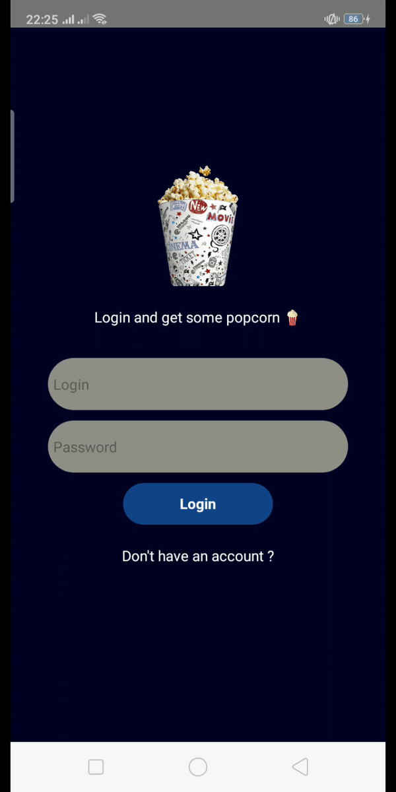
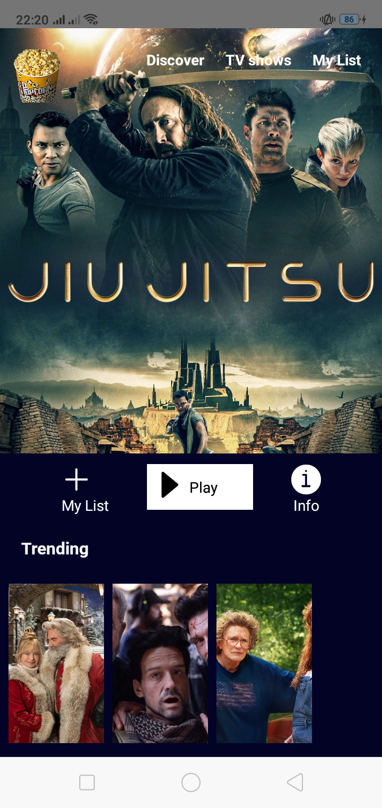
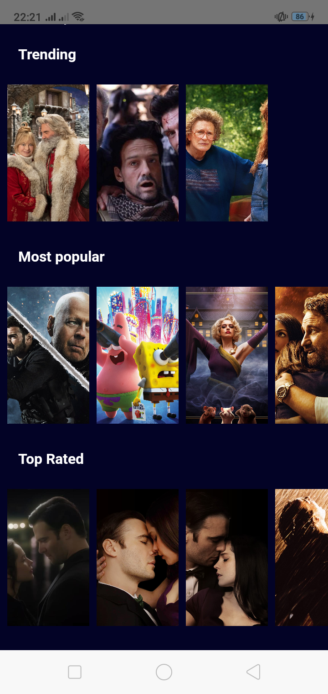

### About :grey_exclamation: : 

  
    
  
  
    
  
  
    
  
  
    
  
  
    
  
  
    
  
  
    
    
    
  
  
  
    
  
  
    
  
  
    
  

 

A movies mobile app or as i call it **"MoviesPocket"**, it's a ReactNative app for movies and TV shows. 

--- 

### Few Screens : 

    
  

    
  
  
    
  
  
    
  

---

### Architecture :evergreen_tree:  : 
In the frontend we've (sure) **React-Native** with **Redux** and in the backend we've **Express.js** + **Firebase** + **Docker**

But here you've just the frontend, the backend will be hosted privately on **AWS** using Docker.

---

_**N.B :** The app might be updated periodically_ :repeat: